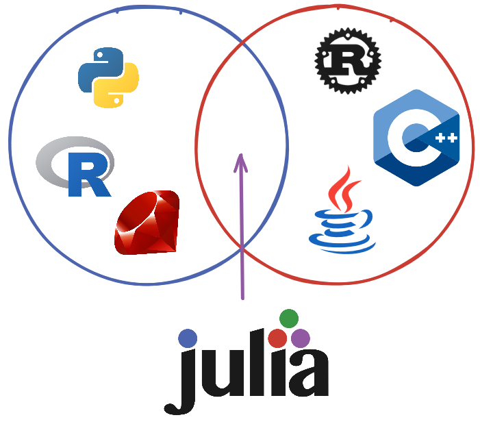
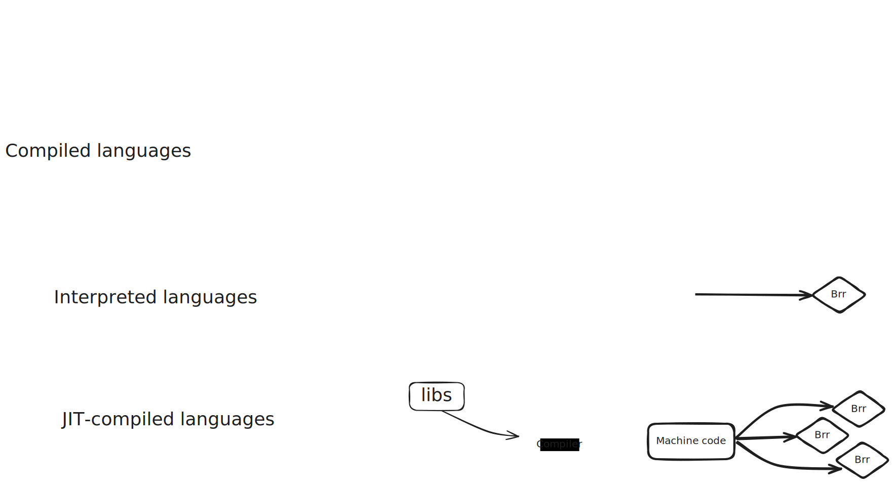

# Introduction to Julia


## Julia's promise (relatively achieved goals)

*The two languages problem*



- As fast (performance) as C.
- As fast (iteration speed) as dynamic, interpreted languages.
- As composable and elegant as cool languages (Lisp).
- As good as a developer UX as Rust.
  - Package manager.
  - Native testing infrastructure.
  - LSP server.
  - Linters, formatters.
- As easy to learn as Python.
- As good for linear algebra as Matlab.
- As good at symbolic stuff as Mathematica.
- Easy to run in your laptop, easy to run concurrently in your laptop, "easy" to run in a cluster of 31298301 nodes, ""easy"" to distribute as embedable binaries.

## Julia's niche 
- Numerical computing, modeling, stats, ML.
- Scientist can research models in the same language that engineers build products on.

## How?
### Just in time (JIT) compilation



- Cost: Time to first output.
- If a piece of code (function) needs to be called multiple times: benefit.
- Abstraction and composition happen at the *dynamic* level.

### Multiple dispatch

- Most languages encourage abstractions via single dispatch, e.g. OOP.

```python
class Dog():
    def sound():
        print("guauguau")

class Cat():
    def sound():
        print("miau")

# dispatches on the type of `animal`
animal.sound() 
```

- Julia is designed from the core around the concept of multiple dispatch.
  - It's the only real mechanism to do abstractions.
  - Allows for very simple, expressive and composable APIs.

```julia
struct Dog end
struct Cat end
abstract type Nationality end
struct Spanish <: Nationality end
struct Dutch <: Nationality end

sound(dog::Dog, nationality::Spanish) = print("guauguau")
sound(dog::Dog, nationality::Dutch) = print("woefwoef")
sound(cat::Cat) = print("miau")
sound(cat::Cat, nationality::Nationality) = print("Workers of the world, unite!")
```

